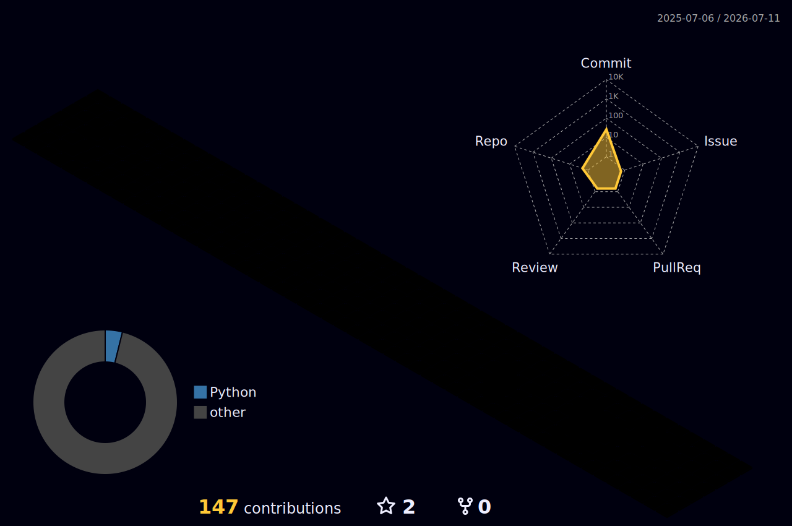

 

  

---

## 💫 About Me

- 💻 Full Stack Jr Developer focused on practical solutions, automation tools, and system integrations.
- 🔭 Currently working on desktop tools, webhook integrations, and enterprise identity-related workflows.
- 🌱 Continuously learning more about Java, Python, C#, machine learning, and connector development.
- 🤝 Open to collaborating on automation, backend utilities, integrations, and real-world technical projects.
- 📍 Based in Curitiba - Brasil

---

## 🛠️ Tech Stack

### Languages & Backend

### Tools & DevOps

### Databases & AI

---

## 📊 GitHub Stats

  

  

---

## 🚀 Featured Projects

  
  

---

## 🐍 Contribution Snake

  <picture>
    <source
      media="(prefers-color-scheme: dark)"
      srcset="https://raw.githubusercontent.com/gabriel-laurino/gabriel-laurino/output/github-snake-dark.svg"
    />
    <source
      media="(prefers-color-scheme: light)"
      srcset="https://raw.githubusercontent.com/gabriel-laurino/gabriel-laurino/output/github-snake.svg"
    />
    
  </picture>

---

## 🌌 3D Contribution Graph

  

---

## 🌐 Connect With Me

---

### ✨ Profile Quote
`Turning repetitive tasks into maintainable and scalable solutions.`

