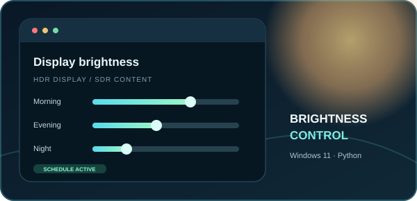
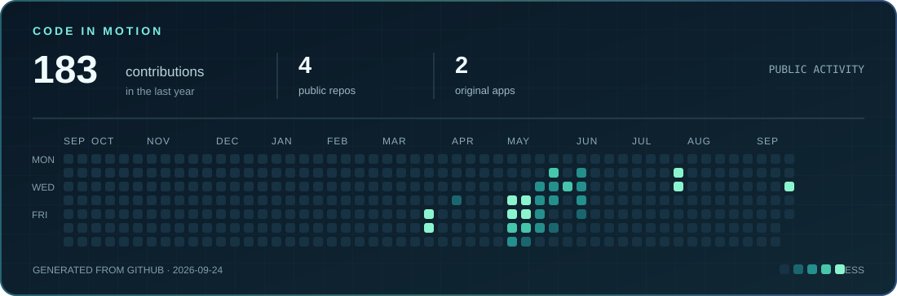

<picture>
  <source media="(max-width: 700px)" srcset="./assets/hero-mobile.svg?v=20260922-1" />
  
</picture>

 

  <a href="https://www.linkedin.com/in/gabriel-laurino">LinkedIn</a>
  &nbsp;·&nbsp;
  <a href="mailto:gabriel_laurino@outlook.com">Email</a>
  &nbsp;·&nbsp;
  <a href="https://github.com/gabriel-laurino?tab=repositories">Repositories</a>

## The work behind the pixels

I build software that takes a complicated process and makes it useful, reliable and understandable. My work spans **full-stack development**, **automation**, **desktop tools** and **enterprise integrations**, with a particular interest in identity and access workflows.

Based in Curitiba, Brazil. Working with Python, Java, C#/.NET, web technologies and the infrastructure that connects them.

| 01 · Build | 02 · Automate | 03 · Connect |
| :--- | :--- | :--- |
| Clear interfaces and maintainable services. | Tools that remove repetitive work. | APIs, events and identity systems that work together. |

## Selected work

<table>
  <tr>
    <td width="50%" valign="top">
      
      <h3><a href="https://github.com/gabriel-laurino/Brightness-Control-Application/releases/tag/v2.0.1">Brightness Control Application v2.0.1 ↗</a></h3>
      
A compact Windows tray app with a modern PySide6 interface, four scheduled brightness periods and safe simultaneous adjustment of active HDR displays. English schedules use AM/PM; SDR displays stay untouched.

      
<code>Python</code> <code>PySide6</code> <code>PowerShell</code>

    </td>
    <td width="50%" valign="top">
      
      <h3><a href="https://github.com/gabriel-laurino/Ngrok_WebhookApp">Webhook Email Service ↗</a></h3>
      
An event-driven Flask integration that receives user creation webhooks and sends email notifications, with encrypted credential handling.

      
<code>Python</code> <code>Flask</code> <code>SMTP</code>

    </td>
  </tr>
</table>

These are public examples of my work. The [interactive portfolio](https://gaabel2.zapto.org/portfolio/) presents the systems and decisions behind them in more detail.

## Activity, drawn from real data

  

The activity visual is generated daily from the GitHub API and stored in this repository. It stays available even when a third-party image service is down. [See how it works](./scripts/render-activity.mjs).

## Tools I reach for

| Software | Interfaces | Systems |
| :--- | :--- | :--- |
| Python · Java · C#/.NET · JavaScript | HTML · CSS · PySide6 | Git · Docker · SQL · PowerShell · Linux |

I choose tools around the problem rather than collecting logos. More about my approach and projects is in the [portfolio](https://gaabel2.zapto.org/portfolio/). [GitHub Pages mirror](https://gabriel-laurino.github.io/gabriel-laurino/).

---

**Have a process worth improving?** [Let's talk on LinkedIn](https://www.linkedin.com/in/gabriel-laurino) or [send me an email](mailto:gabriel_laurino@outlook.com).

